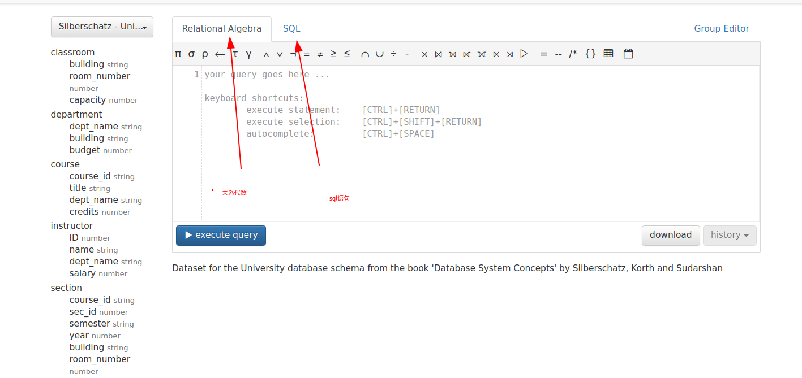
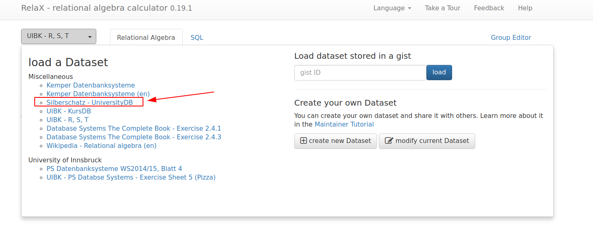
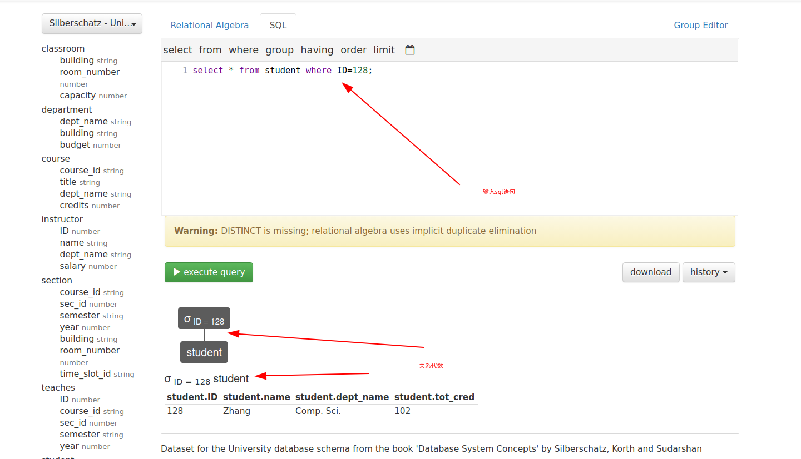
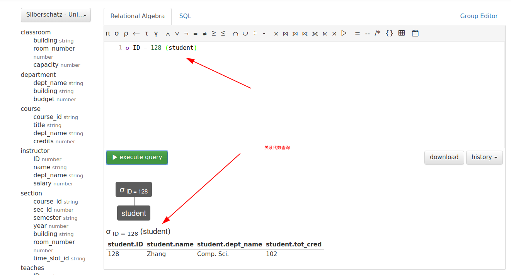

# 关系代数

## 关于我

- 个人网站

  https://light-city.club

- 个人微信公众号


## 1.Relax

> 使用地址：http://dbis-uibk.github.io/relax/calc.htm#

这是一个sql与关系代数练习网站！非常好用，下面来看使用！

如下图所示：支持sql与关系代数语法！




选择数据集：



输入查询语句：(ps 看图发现自动生成关系代数，强不强大！)




输入关系代数：





## 2.实战题目：

用关系代数描述以下查询要求：
查询所有老师和学生的姓名
查询Kim老师的办公地点
查询CS系学生的学分情况
查询database课程成绩在90分以上的学生信息
查询没有选修任何课程的学生信息

选用数据库为Siberschatz-UniversityDB:

关键表解释：

```
instructor(ID, name, dept_name, salary)
deptment(dept_name, building, budget)
student(ID, name, dept_name, tot_cred)
course(course_id, title, dept_name, credts)
takes(ID, course_id, semester, year, grade)

教师信息instructor：教师号ID，教师名字name，教师所在的系dept_name，薪资salary
建筑department：系名dept_name, 建筑building, 预算budget
学生信息student：学生学号ID，学生姓名name，学生所在系dept_name，总学分tot_cred
课程course：课程号course_id，课程名称title，课程所属的系名dept_name，学分credits
选课信息takes：学生学号ID，课程标识course_id，课程段标识sec_id，学期semester，年份year，成绩grade
```


> 找出所有老师与学生的名字

所有老师：

```mysql
select distinct name from instructor;
```

对应的关系代数：

```
π name (instructor)
```

所有学生：

```mysql
select distinct name from student;
```

对应的关系代数：

```
π name (student)
```

> 查询Kim老师的办公地点

```mysql
select b.building from instructor as a, department as b where a.name='Kim' and a.dept_name=b.dept_name;
```

对应的关系代数：

```mysql
π b.building (σ a.name = 'Kim' and a.dept_name = b.dept_name ((ρ a instructor) ⨯ (ρ b department)))
```

先将`department`与`instructor`进行笛卡尔积，然后选择Kim老师的数据，再对`building`进行投影，得到办公地点。

> 查询CS系学生的学分情况

```
select tot_cred from student where dept_name='Comp. Sci.';
```

对应的关系代数：

```
π ID, name, tot_cred σ dept_name = 'Comp. Sci.' (student)
```

> 查询database课程成绩在90分以上(等级为A)的学生信息

```mysql
select s.*,t.grade from student as s,course as c,takes as t where s.dept_name=c.dept_name and t.course_id=c.course_id and c.title='Database System Concepts' and t.grade='A';
```

对应的关系代数：

```
π s.ID,s.name,s.dept_name,s.tot_cred σ c.title='Database System Concepts' and t.grade='A' and c.dept_name=s.dept_name and c.course_id=t.course_id (ρ c course ⨯ ρ t takes ⨯ ρ s student)
```

> 查询没有选修任何课程的学生信息

```
π b.ID,b.name,b.dept_name,b.tot_cred σ a.ID=b.ID ((ρ a ((π ID student) - (π ID takes))) ⨯ (ρ b (student)))
```

先选出所有的学生ID再减去选课表中的学生ID，然后根据ID去检索学生表的信息，就是没有选修任何课程的学生信息。